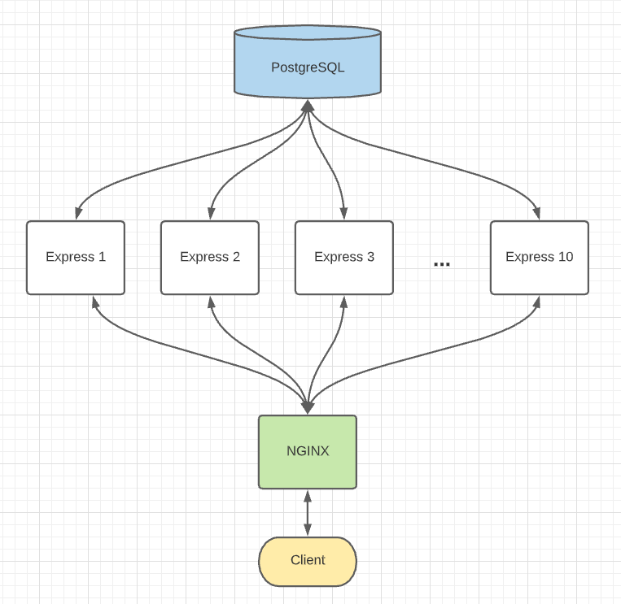

# Atelier Products API

This project is a scalable API server of product information to interface with the [front end](https://github.com/RFP54-Helios/FEC) of a growing online retail portal.

## Contributing

Please read the [contributing docs](CONTRIBUTING.md) before starting any work.

## Tech Stack

### Node.js

- Non-blocking, event-driven server

### Express

- Route HTTP requests to respond with database query results

### PostgreSQL

- Fast database reads at web-scale

### NGINX

- Load balance between many routers

### AWS Elastic Cloud Compute

- Quickly deploy many instances from an image to manage high volumes of traffic

### New Relic APM

- Monitor performance while stress testing to identify optimization opportunities

---

## System Architecture

## Deployment Instructions

See [Deployment Instructions](Deployment.md) to launch this service on AWS.
