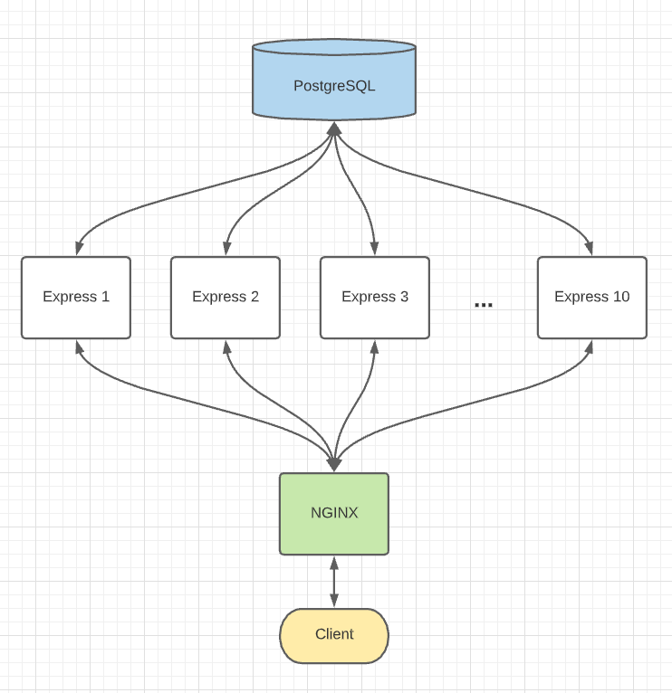

# Deployment Instructions

AWS Elastic Compute Cloud (EC2) enables quick deployment to manage high volumes of traffic


## Launching an EC2 instance

1. Use [Amazon's official docs](https://docs.aws.amazon.com/quickstarts/latest/vmlaunch/step-1-launch-instance.html) to launch an Ubuntu 20.04 LTS EC2 instance
    - In step 4 change ' Amazon Machine Image (AMI)' -> Ubuntu 20.04 LTS
    - In step 7 if you already have a key pair, select to reuse that same key pair. Else download a new key pair in this project directory and modify the permissions on it in bash.
    - Take care to never commit this file to git, all `.pem` files are git ignored in this repository

      ```bash
      chmod 400 secret_key.pem
      ```

1. Connect to this instance via ssh in bash (replace 0.0.0.0 with the IP address of your instance)

    ```bash
    ssh -i secret_key.pem ubuntu@0.0.0.0
    ```

---


## Database Server

1. Launch and connect to a new [EC2 instance](#launching-an-ec2-instance)
1. Add an [inbound security rule](https://docs.aws.amazon.com/AWSEC2/latest/UserGuide/authorizing-access-to-an-instance.html) to allow traffic on TCP port 5432 from anywhere

1. Install [Postgres](https://www.digitalocean.com/community/tutorials/how-to-install-postgresql-on-ubuntu-20-04-quickstart)

    ```bash
    sudo apt-get update && sudo apt-get -y upgrade
    sudo apt-get install postgresql postgresql-contrib​
    ```

1. Transfer the `csv-full` folder to that instance

    ```bash
    scp -i secret_key.pem -r csv-full ubuntu@0.0.0.0:~/
    ```

1. Seed the database by running the [seed script](scripts/seed.sql)

    ```bash
    sudo -u postgres psql < csv-full/seed.sql
    ```

1. Modify the config file `pg_hba.conf`

    ```bash
    sudo vim /etc/postgresql/12/main/pg_hba.conf

    # add this line near bottom (allows remote access)
    host    all             all             0.0.0.0/0               md5
    ```

1. Modify the config file `postgresql.conf`

    ```bash
    sudo vim /etc/postgresql/12/main/postgresql.conf

    # Change line 59 to listen to external requests:
    listen_address='*'
    ```

1. Restart Postgres

    ```bash
    sudo service postgresql restart
    ```

---


## Node Express Server

Starting up a single Express server

1. Launch and connect to a new [EC2 instance](#launching-an-ec2-instance)
1. Add an [inbound security rule](https://docs.aws.amazon.com/AWSEC2/latest/UserGuide/authorizing-access-to-an-instance.html) to allow traffic on TCP port 80 (HTTP) from anywhere
1. Connect via ssh in bash (replace 0.0.0.0 with the IP address of your instance)

    ```bash
    ssh -i secret_key.pem ubuntu@0.0.0.0
    ```

1. Install [Node](https://www.digitalocean.com/community/tutorials/how-to-install-postgresql-on-ubuntu-20-04-quickstart)

    ```bash
    sudo apt-get update && sudo apt-get -y upgrade
    sudo apt-get install postgresql postgresql-contrib​
    ```

1. Configure port forwarding so HTTP requests are handled by your Express server running on port 3000

    ```bash
    sudo iptables -t nat -A PREROUTING -i eth0 -p tcp --dport 80 -j REDIRECT --to-port 3000
    ```

1. Clone this repository

    ```bash
    git clone https://github.com/sdc04-kahlo/Products.git
    ```

1. Install dependencies

    ```bash
    cd Products
    npm install
    ```

1. Make a copy of the `.env` config file and update the values with API keys and the IP address of your Postgres server

    ```bash
    cp .env-sample .env
    vim .env
    ```

1. Start the server

    ```bash
    npm run start:prod
    ```

---


## NGINX Load Balancing Server

1. Launch and connect to a new [EC2 instance](#launching-an-ec2-instance)
1. Install [NGINX](https://nginx.org/en/linux_packages.html#Ubuntu)
1. Paste the below section into the `nginx.conf` file
    - Replace 0.0.0.0 with the IP address of your Express server
    - [Docs here](https://nginx.org/en/docs/http/load_balancing.html)

    ```bash
    $ sudo vim /etc/nginx/nginx.conf

    # nginx.conf
    user  nginx;
    worker_processes  auto;

    error_log  /var/log/nginx/error.log notice;
    pid        /var/run/nginx.pid;


    events {
        worker_connections  1024;
    }

    http {
        upstream products-api {
            server 0.0.0.0;
        }

        server {
            listen 80;

            location / {
                proxy_pass http://products-api;
            }
        }
    }
    ```

1. Reload the NGINX service

    ```bash
     sudo nginx -s reload
    ```

---



## Horizontally Scaling with Many Express Servers

Once you have a single Express server running, you can create an image of that server for spinning up additional Express servers that can be load balanced using NGINX.

1. Create an [Amazon Machine Image](https://docs.aws.amazon.com/toolkit-for-visual-studio/latest/user-guide/tkv-create-ami-from-instance.html) of your Express server
1. Launch multiple new instances [from your new custom AMI](https://aws.amazon.com/premiumsupport/knowledge-center/launch-instance-custom-ami/)
    - A single database instance should be able to handle at least 10 connected Express servers
1. Connect to each server over SSH and start up Express
    - Leave a dedicated terminal open for each server

    ```bash
    ssh -i secret_key.pem ubuntu@0.0.0.0
    cd Products
    npm run start:prod
    ```

1. Add the IP address of each server to the NGINX config file (see [NGINX](#nginx-server) step 3)

    ```bash
      upstream products-api {
        server 0.0.0.0;
        server 0.0.0.0;
        server 0.0.0.0;
      }
    ```
